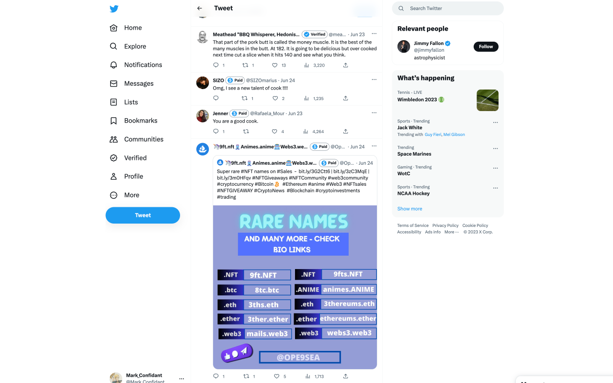
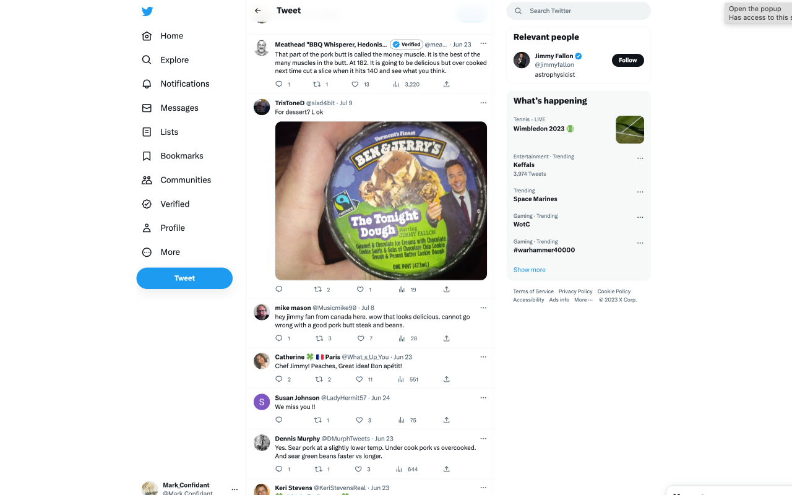

# See Less Blue

See Less Blue is a Chrome extension built to hide Twitter Blue users from your feed, and from replies. Since the current Twitter algorithm aggressively overprioritizes Blue users, this extension is built to directly contravine that. I'm hopeful that after using it, you'll experience significantly less bigotry, crypto scams, spamming, and general bad vibes on Twitter

This code is maintained by [Markus Leben](https://twitter.com/Mark_Confidant), and would not exist without the extremely helpful codebase of the [Eight Dollars](https://github.com/wseagar/eight-dollars) extension. You can [buy me a coffee here](https://ko-fi.com/markconfidant), or [buy them a coffee here](https://www.buymeacoffee.com/eightdollars).

## Installation Instructions

### Install from the Web Store (Do this one unless you're messing around with editing code)

Chrome Web Store is currently reviewing this extension. I will update this readme once it's published.

### Install with this Repo

1. Download this repo and install required libraries.
2. Run npm run build
3. Open chrome extensions, choose 'load unpacked' and find the folder labeled 'build'.

## What it looks like

Here's a before image of a random Jimmy Fallon Tweet:

And here's what it looks like with See Less Blue active:

